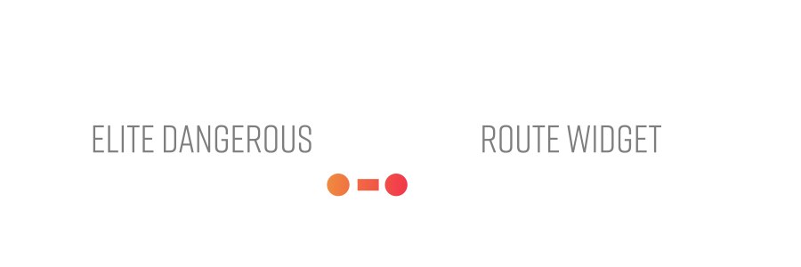
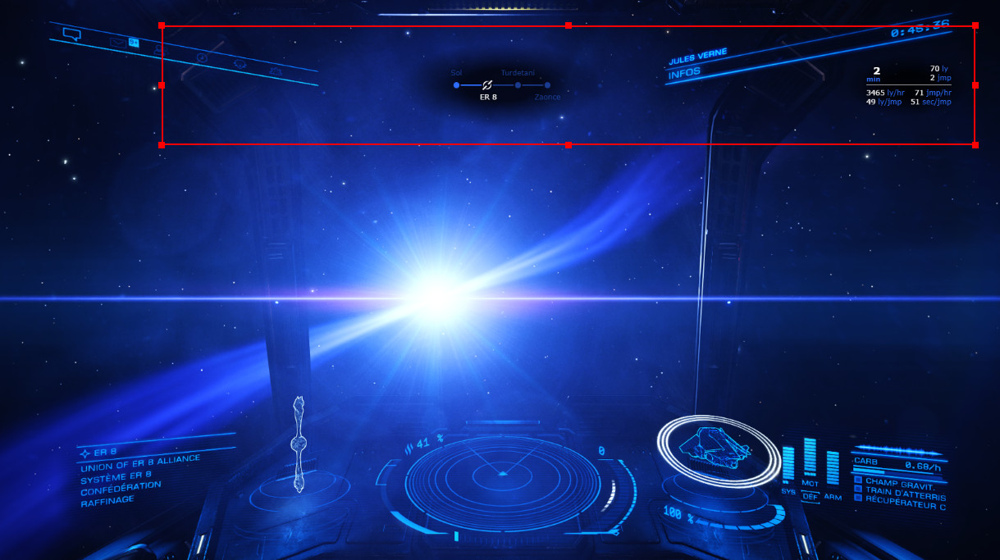
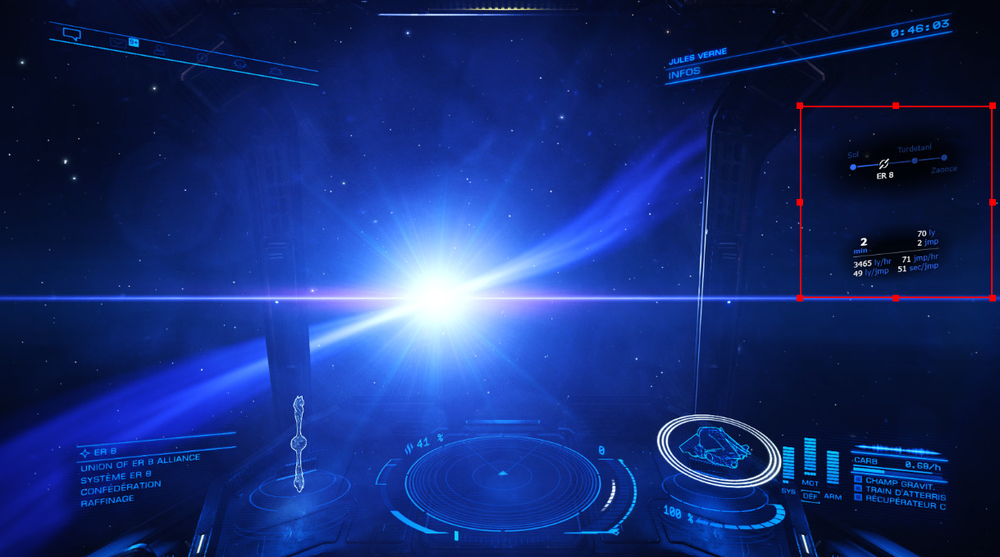

# Elite Dangerous Route Widget (EDRW)
A widget that indicates your position on your current route and some information such as remaining time, distance, and jumps as well as your average speed in light years per hour for example.

This widget is above all designed to be opened as a browser source in streaming software such as OBS. But it can perfectly serve as a companion by being opened in any browser, even on a tablet or mobile.


## Features
- Show your current position on the route in real time
- Show name of each system on the route
- Compact view for system with generic name (those that contain numbers)
- Indicate if the primary star of each system is scoopable or not, a neutron or white dwarf
- Displays the remaining time, distance, and jumps to the destination
- Displays the average over the last 20 jumps (configurable) of the number of light years per hour, of jumps per hour, of light years per jump, and of seconds per jump.
- Transparent background for integration with OBS or equivalent
- It is possible to activate the automatic hiding of the widget when the view in the game is focused on a menu. It will also hide automatically after a certain time (5 min by default, configurable)
- Customizable theme color
- Some customization options (shadow, alternative theme, GUI scale, compact view)
- Synchronization of the customization options between all clients to control the appearance in OBS from another browser.
- The options GUI is only displayed when the view is more than 400px height to prevent it from being displayed in OBS.

### Representation of the type of stars
Five types of stars are represented:


### Compact view
Compact view hides systems with a generic name (those with numbers). This is only displayed when it comes to the commander's current position.


### Custom theme color
You can choose any color for the interface theme. There are two variants. One with the whole line of the route is colored (left). The other where only the part already passed is colored (right).


### Vertical layout
It is also possible to have a vertical layout. It suffices for the size of the browser view to be higher than it is wide.


## Download
### From release
You can download the lastest release from [the releases page](https://github.com/Yori-Mirano/elite-dangerous-route-widget/releases).

There is only package for Windows at the moment. For Mac OS and Linux distribs, you can use source from [this repo](https://github.com/Yori-Mirano/elite-dangerous-route-widget) and follow the instructions in the "Download > From source" section of this README.

#### How to launch
Unzip de package where you want, and execute the file `elite-dangerous-route-widget.bat`.


### From source

#### Prerequisites
Make sure you have installed all of the following prerequisites on your machine:

- [node.js (v12)](https://nodejs.org/dist/latest-v12.x/) - Download & Install Node.js and the npm package manager.


#### Installation 
In a terminal, at the root of the sources folder, type the following command:

```bash
npm install
```

#### How to launch
In a terminal, at the root of the sources folder, type the following command:

```bash
npm start
```

## How to use
Once the app is launched (refer to "Download > How to launch" section), you can then open http://localhost:3000 in a browser or as source in OBS or equivalent **to access the route widget**.

You can also access the widget from another device on the local network via the IP of the machine running the app.

### Add to your overlay in OBS (or equivalent)
For the controls are not displayed, it is necessary that the height of view is less than 400px.




For a better integration with the 3D interface of the game, you can for example add the following CSS parameter in the OBS configuration:

```css
transform: skewY(-6deg);
```



### Configuration and controls
A configuration `config.yml` file is automatically generated when the program is run for the first time. You will have to relaunch it for your changes to take effect (to return to the default configuration, all you have to do is delete the file so that a new one is generated).

Otherwise, most of the parameters related to the display are directly configurable via the widget. To display them, it is enough that the view is greater than 400px.

The settings are synchronized between each instance of the widget. You can thus control the appearance of the widget inserted in OBS via the browser of your PC or another device on the same local network.


## FAQ

### I have an error at launch
Check if the directory path of your E:D logs are correct in the `config.json` file, the `eliteLogDir` parameter. The default value is the Windows default directory of an E:D install.

### The route does not always update
This is a known issue. In some cases, the game does not update the file that contains the route. Unfortunately, there is nothing I can do about it.

I have noticed that this happens when you change an option in the route calculation, but without changing the destination. You must then explicitly choose another destination (any one) and then reselect the desired destination again.

